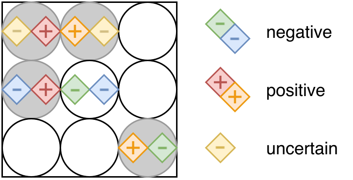

# clonepool

## Increased PCR screening capacity using a multi-replicate pooling scheme

Adrian Viehweger (1, 4, \*), Felix Kühnl (2, \*), Christian Brandt (3, 4), Brigitte König (1)

\* These authors contributed equally.

(1) Medical Microbiology, University Hospital Leipzig  
(2) Bioinformatics, University Leipzig  
(3) Infection Medicine, University Hospital Jena  
(4) [nanozoo](http://www.nanozoo.org/) GmbH, Leipzig


### Abstract

Effective public health response to viral outbreaks such as SARS-CoV-2 is
often informed by real-time PCR screening of large populations. Pooling
samples can increase screening capacity. However, when a traditional pool is
tested positive, all samples in the pool need individual retesting, which
becomes ineffective at a higher proportion of positive samples. Here, we
report a new pooling protocol that mitigates this problem by replicating
samples across multiple pools. The resulting pool set allows the sample
status to be resolved more often than with traditional pooling. At 2%
prevalence and 20 samples per pool, our protocol increases screening capacity
by factors of 5 and 2 compared to individual testing and traditional pooling,
respectively. The corresponding software to layout and resolve samples is
freely available under a BSD license (https://github.com/phiweger/clonepool).

Figure 1: Illustration of the clonepool algorithm. Circles denote the wells, each
containing a pool of samples (small squares). A distinct color marks all
replicates of a single sample. Positive samples are flagged with
"+", negative ones remain empty. Positive pools are shaded in grey, negative ones in
white.  In a first phase, all samples that have at least one replicate in a
negative pool are identified as negative (blue, green). In the second phase,
samples that only occur in positive pools and where at least one replicate is
in a pool where all other samples are negative, are recognized as positive
(red, orange). All other samples cannot be resolved and have to be retested
individually (yellow).



Figure 2: Simulation results for different percentages of positive samples (x-axis),
replicates (colors), and pool sizes (panels). The target metric is the
effective number of samples per PCR reaction, which includes the individual
retesting of samples that cannot be resolved in the first pooling run.


## Install and run

```bash
git clone https://github.com/phiweger/clonepool
cd clonepool

conda env create --file conda_env.yml
conda activate clonepool

pip install -e .

# Generate layout ...
clonepool layout -n 235 -P 5 test/layout.csv
# and add positive pools after experiment (- -> +) or simulate experiment.
clonepool simulate -l test/layout.csv test/simulation.csv
# Finally, resolve which samples are positive, negative or incertain (NA).
clonepool resolve --layout test/simulation.csv test/results.csv
```


